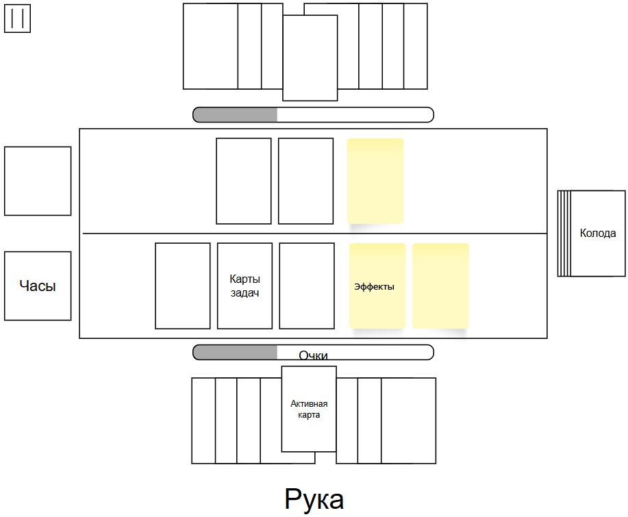

# PythonProject
Мультиплеерная карточная игра, вдохновлённая студенческим искусством тайм-менеджмента.

## Описание проекта
Проект представляет собой карточную игру про безвозвратно утекающее время. В каждом матче двое игроков противостоят друг другу в умении жонглировать дедлайнами™ и грамотно распределять время.

### Игровые правила
**Колода** - стопка карт, участвующих в игре.  
**Рука** - карты, доступные для розыгрыша.  
**Игровой стол** - зона для разыгранных карт.  
**Карты** бывают двух видов:
1. Карты задач;
2. Карты эффектов.

**Карты задач.** Представляют собой описание некоторой задачи, например, "Написать драфт проекта по совместной разработке". У задачи есть срок выполнения (через сколько шагов задача "сгорит") и время, требуемое на выполнение (сколько часов нужно на её выполнение). Если игрок выполняет задачу в срок, то он получает очки; если просрочивает - теряет.  
**Карты эффектов**. Дают бонусы/дебаффы, например, дополнительное время в сутках.  
**Часы** показывают количество времени, доступного игроку в данный ход.  
**Очки** - количество очков у игрока. Игра завершается, если один из игроков смог набрать определённый уровень очков либо потерял все.  

**Структура хода:**
1. **Начало хода:** Игрок получает в свою руку новые карты.
2. **Розыгрыш карт:**  можно сыграть карту задачи или эффекта — на себя (с целью закрыть задачу и получить больше очков) или на соперника (с целью завалить того делами).
3. **Распределение времени:** Игрок должен распределить доступное ему **время** по актуальным задачам так, чтобы успеть завершить работу над задачей до дедлайна™.
4. **Конец хода:** передача хода сопернику или переход к концу дня. Во втором случае происходит подсчёт очков и начинается новый день.

### GUI
Игровое поле имеет следующую структуру:

Схема интерфейса. На рёбрах - кнопки, в узлах - меню.

```mermaid
flowchart TD
    A[Главное меню] -->|Подключиться
    |B(Ввод IP)
    A --->|Создать игру|C(Ожидание противника)
    A ---> |Настройки|D(Настройки)
    A ---> |Выйти| G(Выход)
    B ---> E[Игра]
    C ---> E[Игра]
    E --->|Пауза|F[Пауза]
    F --->|Сдаться|A 
```

### Инструменты решения
Для реализации планируется использовать библиотеку Pygame. Сетевое взаимодействие планируется организовать с помощью сокетов.
